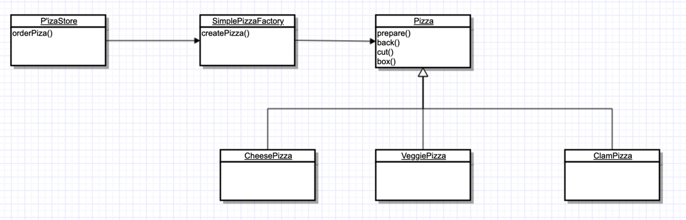
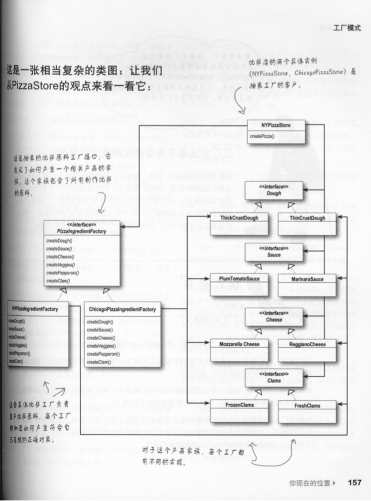

待解决的问题

- 它要解决一个什么问题；
- 它是如何解决问题的；
- 什么时候可以使用它；
- 掌握它的结构图，记住它的关键代码；
- 能够想到至少两个它的应用实例，一个生活中的，一个软件中的；
- 这个模式的优缺点是什么，在使用时要注意什么。


### 工厂模式的意图

#### 开发场景1

A同学写了一堆类，他们分别是，红鸭子，绿鸭子，紫鸭子……一堆鸭子，B同学要在他的代码中去应用这些鸭子，根据不同的条件，要创建不同的鸭子，于是B同学写出的代码是这个样子的：

```java
public class MyClass{

	Duck duck;
	
    MyClass(int type){
        if(int == 0){
            //绿鸭子
            duck = new GreenDuck();
        }else if(int == 1){
            //红鸭子
            duck = new RedDuck();
        }
        ......
    }
}
```


#### new带来的问题

new意味着具体，但是又不能不new，这是创建对象最基本的方式。但是如果在我们的代码中，使用了当量的new的方法来创建对象，那么也就意味着我们在大量的针对实现去编程而非接口。所以病因不在new上，而在于我们在针对具体的实现编程，而针对实现的编程会让程序在将来面临着大量的修改。这违反了我们的设计原则：**依赖接口编程，而非依赖实现编程**。

因此，工厂模式就是来解决这类问题的：

**避免客户端直接创建对象，让客户端能够针对接口编程，将来哪怕是要使用的对象增加了新的类，客户端不用修改任何的代码。**

**总而言之，在代码中直接使用new来创建对象，这种操作影响我们针对接口编程，从而无法享受面对接口便成为我们带来的好处，这就是问题的关键。**

> 针对接口编程的好处
>
> 针对接口编程，可以隔离掉以后系统可能发生的一大堆改变。因为我们的代码如果是针对接口来写，以后增加了任何的新类，我们可以让这个新的类来实现接口，而我们的代码无需做出任何的更改。


#### 解决问题：封装变化

**找出会变的方面，把他们从不变的部分分离出来**。也就是说，我们要把代码中会变的部分找出来并进行封装，会变的是那一部分呢，显而易见是new对象的部分。在上边那个开发场景当中，我们把创建对象的部分抽离到一个DuckFactory当中，然后在MyClass当中将这部分代码替换掉，就完成了一个简单的封装变化的目的。

实际上，这种封装变化的方式，仅仅是一种**编程习惯**，算不上是一种设计模式，但是它的确有一个误导人的名字**简单工厂模式**，以后再遇到这种模式要记住这只是一种编程习惯而已。


### 简单工厂模式

#### 开发场景2

我们有一个生产不同类型的Pizza的Pizza店，利用简单工厂模式这种编程习惯，我们设计出来的类图应该是这样的。




很简单的一个例子，接下来，重量级的设计模式要登场了，他们的的确确可以算得上是真正的设计模式了，而不再是编程习惯。


### 工厂模式


