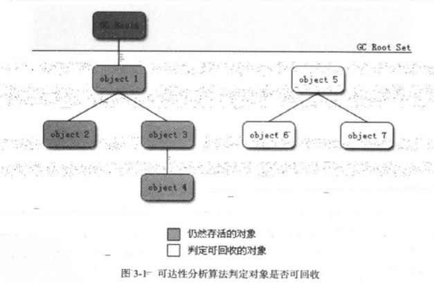
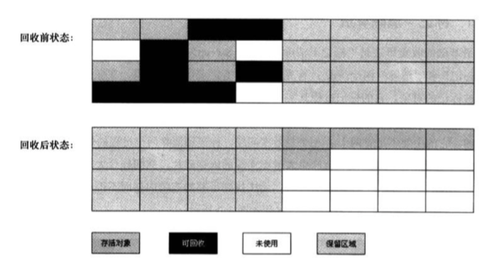

## 概述

GC最基本的3个问题：

* 那哪些内存需要回收
* 什么时候回收
* 如何回收

## 对象已死吗

**垃圾收集器在进行收集之前，会相判断对象是否还存活（还会不会被其他人使用）。**

### 引用计数算法

他很好，但还不够好，主要是很难解决**循环引用**问题。

在Objc当中，采用的自动内存管理机制就是引用计数，这也在编程的过程当中，在使用闭包的时候，很多初级甚至有经验的程序员都容易写出由于循环引用而导致的内存泄漏问题。因此，主流的虚拟机并没有使用这种算法来判断对象是否存活。

### 可达性分析算法

感兴趣，可以再研究一下，作为一个子课题，目前来看并不重要。

### 再谈引用

JDK1.2之前的引用的概念定义，非常的狭隘，引用被定义成一个指向另一块内存的内存空间所存储的数据。如果从这个定义之上来讨论一个对象的状态，就只存在两种状态：

* 被引用
* 没有被引用

这样，一些中间状态的对象状态就无法表示。

JDK1.2后，对这个定义进行了扩充，引用可分为：

* 强引用
* 软引用
* 弱引用
* 虚引用

这些引用类型对对象的引用，从强到弱。

### 生存还是死亡

判定对象死亡分两步进行标记：

1. 利用上述的算法判定其是否还在被引用，若没有则进行标记。然后根据情况考虑是否要执行finalize()方法，需要执行则把对象放入F-Queue队列中，并稍后在一个由虚拟机自动建立的、低优先级的线程中执行。
2. 在F-Queue中的对象进行第二次标记，对象可能在finalize()方法中进行自救，此时可以把它移除将要回收的集合，若对象没有进行自救，那么这个对象基本就是要被回收了的。

> 注意：对象finalize()方法只会被调用一次。

### 回收方法区

回收条件极为苛刻，主要针对常量池中不再使用的常量进行回收。可通过虚拟机参数设定是否需要回收此区域，感觉在java web的开发过程中，这块区域的垃圾回收并不是那么重要，不多做记录。

## 垃圾收集算法

### 标记清除算法

最基础的算法，其他的都是根据这个算法优化得来的，这个算法的不足之处：

* 标记和清除的效率都不高
* 会产生大量的内存碎片，导致之后的大对象无法找到连续的内存空间进行分配。

### 复制算法(现代虚拟机采用这种手机算法来回收新生代)

将新生代内存分为3块，一块较大的Eden和两块较小的Survivor，默认比例8：1：1，当垃圾回收的时候，将Eden和其中一块Survivor上还存活着的对象一次性copy到另一块Survivor上，最后清理掉Eden和那块用过的Survivor的内存空间。

这个算法，建立在新生代**朝生夕死**的特性之上(98%的对象，在垃圾收集的时候都死了)。为了应对存活对象过多的而导致的Survivor（存放活下来的对象那块空间）空间不够的特殊情况，还需要一种担保机制，也就是把老生代的内存空间作为担保（请理解担保的概念），一旦发生特殊情况，就把多存活下来的那些对象copy到老生代的控件当中去。

### 标记-整理算法(老年代的收集算法)

### 分代收集算法

商业虚拟机的额垃圾收集都采用"分代收集"算法。将Java堆分为新生代和老年代，按照两个代的特点选用不同的算法进行收集。

## Hotspot的算法实现

算法的实现要注重效率，尤其是像虚拟机这样的软件。这节了解一下就行了。

### 枚举根节点

为了提升枚举根节点的效率，HotSpot使用了一组OopMap的数据结构，来得知哪些地方存放着对象引用。只需要遍历这其中的根节点即可判断对象是否死亡。

### 安全点

但是导致OopMap中的内容变化的指令非常多，为了保证在垃圾收集的时候OopMap的内容不会变，所以给线程设置了一个安全点，线程到达安全点后轮训一下垃圾收集器是否改动了进行垃圾收集的标志位，若改动了，则线程暂停，垃圾收集器可以安全的进行垃圾回收。

### 安全区域

跟安全点差不多，这个区域不会产生引用关系的变化，都是为了能够安全的进行垃圾收集，线程进入安全区首先标识自己已经进入安全区，垃圾收集器就不管他了，出安全区的时候看看垃圾收集器是否已经收集完毕，收集完毕才可以退出安全区。

## 垃圾收集器

- [ ] 每一个进程都需要一个虚拟机吗？
- [ ] 8：1：1为什么不直接设计为9：1？

### CMS收集器

响应速度快

适合和互联网站或者B/S系统的服务端

基于"标记-清除"算法实现

4步骤：

* 初始标记
* 并发标记(耗时，可与用户线程并行工作)
* 重新标记
* 并发清除(耗时，可与用户线程并行工作)

总体来看，CMS收集器的内存回收过程是与用户线程并发执行的。

缺点：

* 对CPU资源而非常敏感。

- [ ] 这块随后整理一个表吧，太混乱，不好记。

## 内存分配与回收策略

* 给对象分配内存
* 回收分配给对象的内存 * 

一下是使用Cliend模式虚拟机运行，Serial/Serial Old的收集器组合方式的内存回收策略。

### 对象优先在Eden分配

大多数情况下，对象在新生代Eden中分配。当Eden区没有足够的空间可以分配的时候，虚拟机将发起一次 **Minor GC**-

指发生在新生代的垃圾收集动作。老年代的GC叫做 Major GC或者Full GC。

### 大对象直接进入老年代

可通过设置-XX:PretenureSizeThreeshold这个参数来设置新生代对象的最大值。这个参数支队Serial和ParNew有效。

### 长期存活的对象将进入老年代

虚拟机给每个对象定义了一个对象年龄。

Minor GC后，仍然存活，并且能被Survivor容纳，就移动他，然后将对象年龄设为1。它每熬过一个Minor GC，年龄就增加1岁，年龄增加到15岁，就会被晋升到老年代。可通过-XX:MaxTeenuringThreshold设置。

### 动态对象年龄判断

没必要必须到年龄，当Survivor空间中的相同年龄的所有对象大小的综合大于Survivor空间的一半，年龄大于或等于改年龄的对象就可以直接额进入老年代。

### 空间分配担保

老年代担保失败，就会根据**HandlePromotionFailure**这个虚拟机参数判断是否需要进行一次FullGC。