盲点

* Java反射
* HashMap实现原理


为什么要使用Spring？

 * Spring解决了什么问题？
 * 怎样解决的？
 * 我们从中获取了什么好处？

知道此三个问题，就能够知道我们为什么在用Spring。


个人在工作中的重要性体现在你的专业知识能够为企业带来多大程度的好处。所以专业知识的学习需要以企业所面临的问题为导向。小型公司所面临的问题是什么？中型公司所面临的问题是什么？大型公司所面临的问题是什么？


会用，并且用好Spring这个框架。

三次革命

节省全世界的开发者的时间，提高了多少生产力

提高生产力

一劳永逸


为什么需要IOC？

IOC的具体意义是什么？

他到底有什么独到之处？


IOC的好处

便于系统扩展。

便于单元测试。


## 掌管大局的IOC Service Provider

将依赖工作从本类（这个东西可以认为是应用程序当中的业务代码吧）当中移除，放在其他专门用来绑定对象关系的类（这个应该是可以认为是框架代码）当中去做。


Spring的IOC容器就是一个提供依赖注入服务的IOC Service Provider。IOC Sercice Provider负责将对象绑定起来（当然对象之间是存在依赖的，没有依赖绑个屁啊）。


### IOC Service Provider的职责

* 业务对象的构建管理
* 业务对象间的依赖绑定


## IOC Service Provider如何管理对象之间的依赖关系

通过在一个地方把这些依赖关系记录下来，主要通过三种方式

* 直接编码方式
* 配置文件方式
* 元数据方式


## Spring的IOC容器的BeanFactory

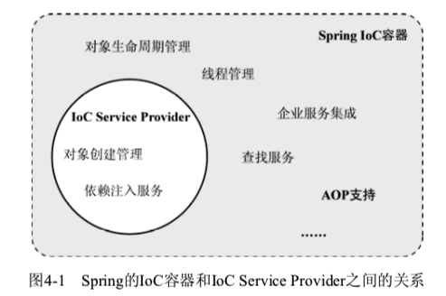

两种容器类型：

* BeanFactory
* ApplicationContext


二者的关系：

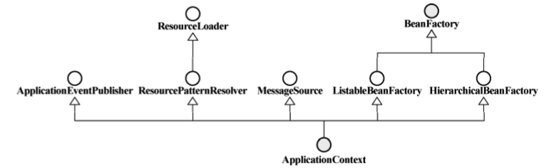


ApplicationContext 类体系结构

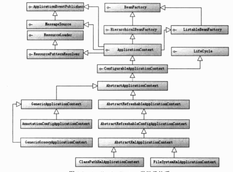


BeanFactory类体系结构

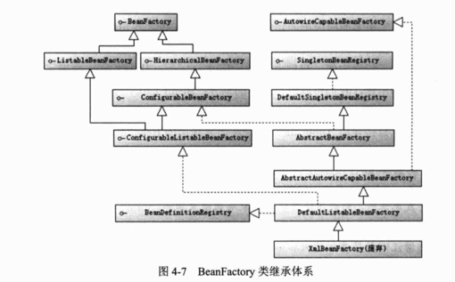


BeanFactory提供ISP的所有职责（这个职责上边以及记录过了）。


与BeanFactory打交道很简单，最基本的，他会提供一个取得组装完成的对象的接口。

BeanFactory的定义

```java
public interface BeanFactory {
    String FACTORY_BEAN_PREFIX = "&";
    Object getBean(String name) throws BeansException;
    Object getBean(String name, Class requiredType) throws BeansException; /**
    * @since 2.5
    */
    Object getBean(String name, Object[] args) throws BeansException; boolean containsBean(String name);
    boolean isSingleton(String name) throws NoSuchBeanDefinitionException; /**
    * @since 2.0.3
    */
    boolean isPrototype(String name) throws NoSuchBeanDefinitionException; /**
    * @since 2.0.1
    */
    boolean isTypeMatch(String name, Class targetType) throws NoSuchBeanDefinitionException; 
    Class getType(String name) throws NoSuchBeanDefinitionException;
    String[] getAliases(String name);
}
```


### 有了BeanFactory之后对我们的影响

没啥影响，就是业务对象之间的依赖关系已经不再需要我们自己来管理了，BeanFactory会说，让我来干吧。它通过XML文件来构建对象并将对象的依赖绑定起来，然后我们通过它来获取我们需要的对象。

原来我们这样获取对象：

```java
Bean object = new Bean();
```

现在我们这样获取对象：

```java
BeanFactory container = new XmlBeanFactory(new ClassPathResource("配置文件路径"));
Bean bean = container.getBean("beanid");
```

或者

```java
ApplicationContext container = ➥
new ClassPathXmlApplicationContext("配置文件路径");
Bean newsProvider = container.getBean("beanid");
```

或者

```java
ApplicationContext container = ➥
new FileSystemXmlApplicationContext("配置文件路径");
Bean newsProvider = (FXNewsProvider)container.getBean("beanid");
```


### BeanFactory的对象注册与依赖绑定方式


### 容器背后的秘密

#### 战略性观望

Spring IOC所起的作用是它会以某种方式加载Configuration Metadata（通常是XML格式配置的信息），然后根据这些信息绑定整个系统的对象，最终组装成一个可用的基于轻量级容器的应用系统。

Spring容器实现以上的功能基本上分为两步：

* **容器启动**
* **Bean实例化**

容器启动伊始，首先会通过某种途径加载Configuration MetaData，并对Configuration MetaData进行解析和分析，将分析后的信息编组为相应的BeanDefinition，最后把这些保存了bean定义必要信息的BeanDefinition，注册到相应的BeanDefinitionRegistry，这样容器启动工作就完成了。


经过第一阶段，现在所有的bean定义信息都通过BeanDefinition的方式注册到了BeanDefinitionRegistry中。当某个请求方通过容器的getBean方法明确地请求某个对象，或者因依赖关系容器需要隐式地调用getBean方法时，就会触发第二阶段的活动。 

该阶段，容器会首先检查所请求的对象之前是否已经初始化。如果没有，则会根据注册的 BeanDefinition所提供的信息实例化被请求对象，并为其注入依赖。如果该对象实现了某些回调接 口，也会根据回调接口的要求来装配它。当该对象装配完毕之后，容器会立即将其返回请求方使用。 **如果说第一阶段只是根据图纸装配生产线的话，那么第二阶段就是使用装配好的生产线来生产具体的产品了。** 


#### 插手容器的启动

**BeanFactoryPostProcessor**扩展机制，允许在Bean进行实例化之前，对注册到容器的BeanDefinition所保存的信息做相应的修改。

* **PropertyPlaceholderConfigurer**

* **PropertyOverrideConfigurer**

是两个由Spring提供的**比较常用**的BeanFactoryPostProcessor实现。

我们可以通过两种方式来应用BeanFactoryPostProcessor，分别针对基本的IoC容器BeanFactory和较为先进的容器ApplicationContext。


**CustomEditorConfigurer**是另外一种类型的BeanFactoryPostProcessor实现。

着重记录一下这个后处理器。

1. 创建一个日期属性的属性编辑器。

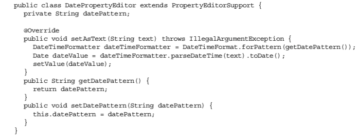


2. 假设我们有一个业务对象DateFoo，他有一个Date类型的属性需要被按照指定的格式被注入，但是Spring找不到合适的PropertyEditor把XML当中配置的属性字符串转化成我们想要的格式。

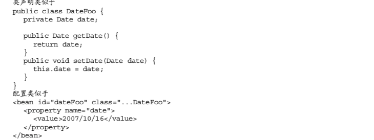


3. 于是乎，我们就给Spring的IOC 容器的在动阶段放进去一个我们自定义的PropertyEditor。于是，IOC容器在启动阶段，通过CustomEditorConfigurer这个后处理器，就解决了该如何处理日期类型的属性注入问题。

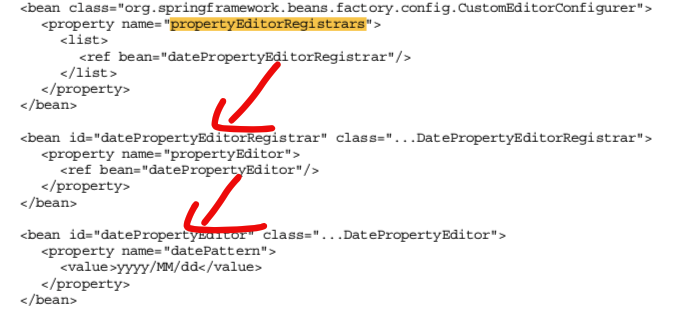


#### Bean的生命周期

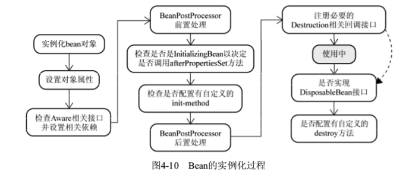


Aware和BeanPostProcessor留出的扩展点，为什么不在第一阶段从XML中加载Bean信息的时候就让我们把所有信息一次写清，却要在第二步实例化的时候留出扩展点让我们去插入相应的信息？


## Spring的IOC容器的ApplicationContext


ApplicationContext是Spring在BeanFactory基础容器之上，提供的另一个IoC容器实现。它拥有许多BeanFactory所没有的特性，包括

* 统一的资源加载策略

* 国际化信息支持

* 容器内事件发布

* 简化的多配置文件加载功能。

  

  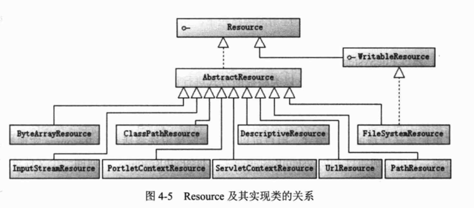


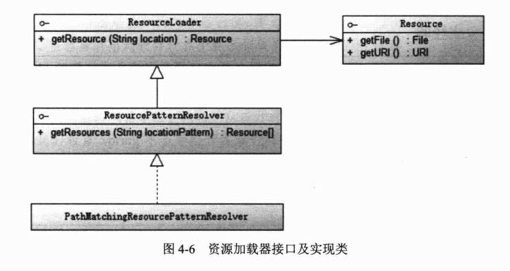


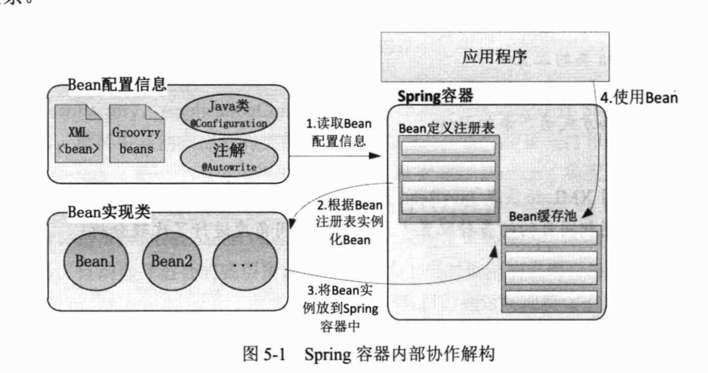