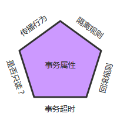

# Spring事务管理

## 事务的基础知识

事务本身有四个属性

* 原子性
* 一致性
* 隔离性
* 持久性

重点记录一下**隔离性**。

4中隔离级别

* Read UnCommited

  > 会产生脏读、不可重复读、幻读的问题

* Read Commited

  > 会产生不可重复读、幻读的问题

* Repeatable Read

  > 会产生幻读的问题

* Serializable

  > 可以规避脏读、不可重复读、幻读等问题。

这四种隔离级别与**数据库性能**成反比，与**数据一致性**成正比。如下图所示：

## 事务家族的成员

* Resource Manager（RM）:负责存储并管理系统数据资源的状态。
* Transaction Processor Monitor（TPM）:一般负责在分布式场景中协调包含多个RM的事务处理。
* Trasaction Manager（TM）：可以认为是TPM的核心模块，直接负责多**RM之间事务处理的协调**工作，并且**提供事务界定**、**事务上下文传播**等功能接口。
* Application：以独立形式存在的或者运行于容器中的应用程序。

若根据**整个事务中包含的RM的多寡**来区分事务的类型的话，可将事务分为两类：

* 全局事务
* 局部事务

### 全局事务（分布式事务）

若整个事务处理的过程当中有多个RM参与，那么就需要引入TPM类协调多个RM之间的事务处理。TPM采用**两阶段提交协议**来保证事务的ACID属性。

### 局部事务

若整个事务处理的过程当中只有一个RM参与，就可以称当前事务为局部事务。

## Java事务管理

### Java平台的局部事务支持

### Java平台的分布式事务支持

## Spring事务王国的架构

设计的基本原则：**让事务管理的关注点与数据访问关注点相隔离**。

## 使用Spring进行事务管理

### 编程式事务管理

两种方式：

* PlatformTransactionManager

* TransactionTemplate(推荐)

## 事务5属性

* 传播行为
* 隔离级别
* 只读
* 事务超时
* 回滚规则

### 传播行为

| PROPAGATION_REQUIRED      | 表示当前方法必须运行在事务中。如果当前事务存在，方法将会在该事务中运行。否则，会启动一个新的事务 |
| ------------------------- | :----------------------------------------------------------: |
| PROPAGATION_SUPPORTS      | 表示当前方法不需要事务上下文，但是如果存在当前事务的话，那么该方法会在这个事务中运行 |
| PROPAGATION_MANDATORY     | 表示该方法必须在事务中运行，如果当前事务不存在，则会抛出一个异常 |
| PROPAGATION_REQUIRED_NEW  | 表示当前方法必须运行在它自己的事务中。一个新的事务将被启动。如果存在当前事务，在该方法执行期间，当前事务会被挂起。如果使用JTATransactionManager的话，则需要访问TransactionManager |
| PROPAGATION_NOT_SUPPORTED | 表示该方法不应该运行在事务中。如果存在当前事务，在该方法运行期间，当前事务将被挂起。如果使用JTATransactionManager的话，则需要访问TransactionManager |
| PROPAGATION_NEVER         | 表示当前方法不应该运行在事务上下文中。如果当前正有一个事务在运行，则会抛出异常 |

### 隔离级别

* 脏读（Dirty reads）——脏读发生在一个事务读取了另一个事务改写但尚未提交的数据时。如果改写在稍后被回滚了，那么第一个事务获取的数据就是无效的。
* 不可重复读（Nonrepeatable read）——不可重复读发生在一个事务执行相同的查询两次或两次以上，但是每次都得到不同的数据时。这通常是因为另一个并发事务在两次查询期间进行了更新。
* 幻读（Phantom read）——幻读与不可重复读类似。它发生在一个事务（T1）读取了几行数据，接着另一个并发事务（T2）插入了一些数据时。在随后的查询中，第一个事务（T1）就会发现多了一些原本不存在的记录。

| ISOLATION_DEFAULT          |                 使用后端数据库默认的隔离级别                 |
| -------------------------- | :----------------------------------------------------------: |
| ISOLATION_READ_UNCOMMITTED | 最低的隔离级别，允许读取尚未提交的数据变更，可能会导致脏读、幻读或不可重复读 |
| ISOLATION_READ_COMMITTED   | 允许读取并发事务已经提交的数据，可以阻止脏读，但是幻读或不可重复读仍有可能发生 |
| ISOLATION_REPEATABLE_READ  | 对同一字段的多次读取结果都是一致的，除非数据是被本身事务自己所修改，可以阻止脏读和不可重复读，但幻读仍有可能发生 |
| ISOLATION_SERIALIZABLE     | 最高的隔离级别，完全服从ACID的隔离级别，确保阻止脏读、不可重复读以及幻读，也是最慢的事务隔离级别，因为它通常是通过完全锁定事务相关的数据库表来实现的 |

###  只读

事务的第三个特性是它是否为只读事务。如果事务只对后端的数据库进行该操作，数据库可以利用事务的只读特性来进行一些特定的优化。通过将事务设置为只读，你就可以给数据库一个机会，让它应用它认为合适的优化措施。

### 事务超时

为了使应用程序很好地运行，事务不能运行太长的时间。因为事务可能涉及对后端数据库的锁定，所以长时间的事务会不必要的占用数据库资源。事务超时就是事务的一个定时器，在特定时间内事务如果没有执行完毕，那么就会自动回滚，而不是一直等待其结束。

###  回滚规则

事务五边形的最后一个方面是一组规则，这些规则定义了哪些异常会导致事务回滚而哪些不会。默认情况下，事务只有遇到运行期异常时才会回滚，而在遇到检查型异常时不会回滚（这一行为与EJB的回滚行为是一致的） 
但是你可以声明事务在遇到特定的检查型异常时像遇到运行期异常那样回滚。同样，你还可以声明事务遇到特定的异常不回滚，即使这些异常是运行期异常。

## 相关配置

http://www.blogjava.net/robbie/archive/2009/04/05/264003.html