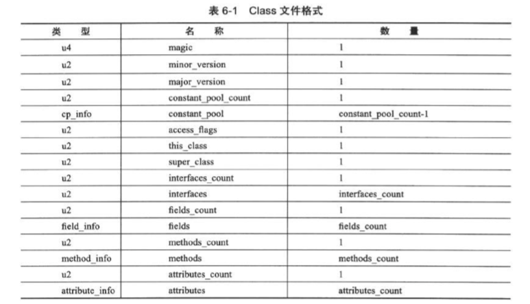

## Class文件的结构

### 基本概念

CLass文件采用一种类似于C语言的结构体的伪结构来存储数据，这种结构只有两种数据类型：无符号数和表。

**无符号数**

基本的数据类型，以u1,u2,u4,u8来分别代表1、2、4、8个字节的无符号数。无符号数**可以用来描述数字、索引引用、数量值或者按照UTF-8编码构成字符串值**。

**表**

由多个无符号数或者其他表作为数据项构成的符合数据类型，所有表都性惯性的用"_info"结尾。表用于描述有层次关系的额复合结构的数据，整个Class文件本质上就是一张表，它由下表所示的数据项构成。

### 魔数和class文件版本信息

魔术用来标识是否是一个Class文件，Class文件的魔数用16进制标识是CAFEBABE。

版本信息分为次版本和主版本，主版本号从45开始，对应JDK1.1。JDK向下兼容旧版本的Class文件。例如，major_version为0x34（52），则支持的JDK为，1 + (52 -45) = 8，也就是1.8以及1.8以上版本的JDK都可以执行这个Class文件。

### 常量池

资源仓库。

入口放置一项u2类型的数据来代表常量池的容量。

常量池计数从1开始。

主要存放两大类常量：

* 字面量

  `如文本字符创、final常量等`

* 符号引用

  包括如下三类常量：

  * 类和接口的全限定名
  * 字段的名称和描述符
  * 方法的名称和描述符

不保存方法、字段的内存布局信息。—之后章节有讲

常量池中的每一项常量都是一个表。

### 字段表集合

## 字节码指令

**止于符号链接、编译、动态加载。**

