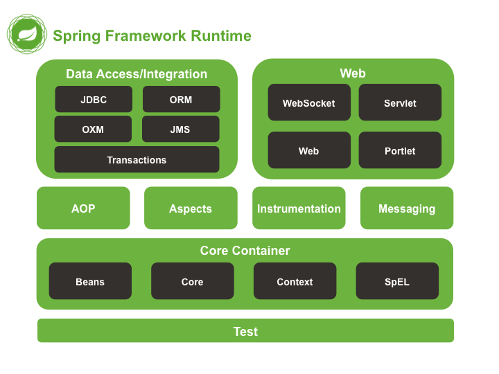

## Spring Modules



## Core Container

Well, Spring IoC stands for **Inversion of Control**. It is the heart of the Spring Framework. The important tasks performed by the IoC container are:

1. Instantiating the bean 
2. Wiring the beans together
3. Configuring the beans
4. Managing the bean’s entire life-cycle

 Here is a diagrammatic representation of how beans are wired together by IoC container.


Spring BeanFactory Container 

>  org.springframework.beans.factory.BeanFactory

Spring ApplicationContext Container (**generally recommended**)

> org.springframework.context.ApplicationContext


## Beans

### 1.Definition

The objects that form the backbone of your application and that are managed by the Spring IoC container are called **beans**.

```xml
<?xml version = "1.0" encoding = "UTF-8"?>

<beans xmlns = "http://www.springframework.org/schema/beans"
   xmlns:xsi = "http://www.w3.org/2001/XMLSchema-instance"
   xsi:schemaLocation = "http://www.springframework.org/schema/beans
   http://www.springframework.org/schema/beans/spring-beans-3.0.xsd">

   <!-- A simple bean definition -->
   <bean id = "..." class = "...">
      <!-- collaborators and configuration for this bean go here -->
   </bean>

   <!-- A bean definition with lazy init set on -->
   <bean id = "..." class = "..." lazy-init = "true">
      <!-- collaborators and configuration for this bean go here -->
   </bean>

   <!-- A bean definition with initialization method -->
   <bean id = "..." class = "..." init-method = "...">
      <!-- collaborators and configuration for this bean go here -->
   </bean>

   <!-- A bean definition with destruction method -->
   <bean id = "..." class = "..." destroy-method = "...">
      <!-- collaborators and configuration for this bean go here -->
   </bean>

   <!-- more bean definitions go here -->
   
</beans>
```


### 2.Scope

* **singleton**
* **prototype**
* **request**
* **session**
* **global-session**


### 3.Life Cycle

暂时只看了初始化和被销毁这两个生命周期。也是最被经常使用的两个生命周期结点。


### 4.Post Processors

```java
public class InitHello implements BeanPostProcessor,Ordered {

    public Object postProcessBeforeInitialization(Object bean, String beanName) throws BeansException {
        System.out.println(beanName + " Before Initialization" + "1");
        return bean;
    }

    public Object postProcessAfterInitialization(Object bean, String beanName) throws BeansException {
        System.out.println(beanName + " After initialization" + "1");
        return bean;
    }

    public int getOrder() {
        return 1;
    } 
}
```

### 5.Bean Inheritance

```xml
<bean id ="helloIndia" class = "xin.desertcamel.HelloIndia" parent = "beanTeamplate">
       <!-- id为helloWorld的bean的属性会被这里的设置所覆盖 -->
      <property name = "message1" value = "Hello India!"/>
      <property name = "message3" value = "Namaste India!"/>
   </bean>

   <!--  注意这里被标记成为了abstract,将和所有继承自这个地方的所有子标签共同描述一个bean -->
   <bean id="beanTeamplate" abstract="true" init-method="init" destroy-method="destroy">
      <property name="message1" value="Hello World!" />
      <property name="message2" value="Hello Second World!" />
      <property name="message3" value="Namaste India!" />
   </bean>
```


## Dependenct Injection(DI)

没有使用DI的时候，依赖是在我们的Bean当中创建的

```java
public class TextEditor {
   private SpellChecker spellChecker;
   
   public TextEditor() {
      spellChecker = new SpellChecker();
   }
}
```

使用DI之后，对于依赖的控制被拿到其他地方，于是他们把这种行为叫做控制反转，也就是说对于依赖的控制不在我们的类当中了，我们不再有对依赖的控制权，而是把这个权利给了其他人（这个其他人现在还没搞清楚）。

使用了DI之后。

```java
public class TextEditor {
   private SpellChecker spellChecker;
   
   public TextEditor(SpellChecker spellChecker) {
      this.spellChecker = spellChecker;
   }
}
```


有两种依赖注入的方式：

* Constructor-based DI
* Setter-based DI


DI带来的好处

The code is cleaner with the DI principle and decoupling is more effective when objects are provided with their dependencies. The object does not look up its dependencies and does not know the location or class of the dependencies, rather everything is taken care by the Spring Framework.


可以在两个地方对bean的注入进行配置：

* 在配置文件当中进行手动配置或者基于**byType**等标签属性的自动配置。
* 利用注解（**Autowired**等）进行配置。


### Event Handling in Spring

ApplicationContext publishes certain types of events when loading the beans. 

Spring 提供了几个标准事件：

* **ContextRefreshedEvent**
* **ContextStartedEvent**
* **ContextStoppedEvent**
* **ContextClosedEvent**
* **RequestHandledEvent**


## JDBC Framework

While working with the database using plain old JDBC, it becomes cumbersome to write unnecessary code to handle exceptions, opening and closing database connections, etc. However, Spring JDBC Framework takes care of all the low-level details starting from opening the connection, prepare and execute the SQL statement, process exceptions, handle transactions and finally close the connection.

So what you have to do is just define the connection parameters and specify the SQL statement to be executed and do the required work for each iteration while fetching data from the database.

Spring JDBC provides several approaches and correspondingly different classes to interface with the database. I'm going to take classic and the most popular approach which makes use of **JdbcTemplate** class of the framework. This is the central framework class that manages all the database communication and exception handling.


### Transaction Management（待补充）

看tutorial没有看懂，晕~~


## Web MVC Framework

- The **Model** encapsulates the application data and in general they will consist of POJO.
- The **View** is responsible for rendering the model data and in general it generates HTML output that the client's browser can interpret.
- The **Controller** is responsible for processing user requests and building an appropriate model and passes it to the view for rendering.


关注一下DispatcherServlet


Following is the sequence of events corresponding to an incoming HTTP request to *DispatcherServlet* −

- After receiving an HTTP request, *DispatcherServlet* consults the *HandlerMapping* to call the appropriate *Controller*.
- The *Controller* takes the request and calls the appropriate service methods based on used GET or POST method. The service method will set model data based on defined business logic and returns view name to the *DispatcherServlet*.
- The *DispatcherServlet* will take help from *ViewResolver* to pickup the defined view for the request.
- Once view is finalized, The *DispatcherServlet* passes the model data to the view which is finally rendered on the browser.

**All the above-mentioned components, i.e. HandlerMapping, Controller, and ViewResolver are parts of *WebApplicationContext* w which is an extension of the plain*ApplicationContext* with some extra features necessary for web applications.**

这块是个重点，Spring MVC其实是对Spring核心的一个扩充。


## Logging With Log4j

Log4j没用过，这块需要等之后去了解一下Log4j，日志也是比较重要的一块，需要专门找个时间好好理解一下在Java里边的日志操作以及Log4j的使用和在Spring当中两个框架的集成。