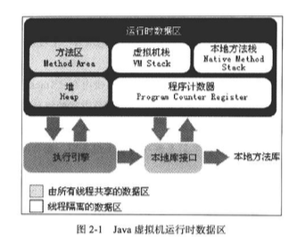
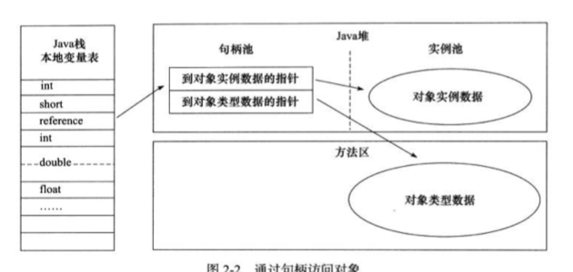
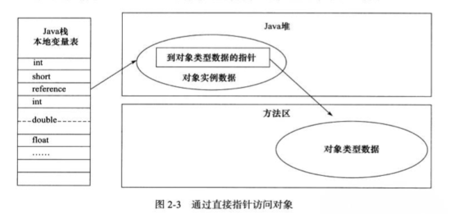

## 运行时数据区域

### 程序计数器

线程私有内存。

为了保证线程切换后能够恢复到正确的位置。

如果线程正在执行一个方法，计数器记录的是正在执行的虚拟机字节码指令的地址。

如果线程正在执行Native方法，计数器值为空。

问题：

- [ ] 虚拟机字节码指令是什么？
- [ ] 虚拟机字节码指令的地址又是如何计算的？
- [ ] 什么是Native方法？

### Java虚拟机栈

线程私有内存。

生命周期=线程的生命周期。

描述的是Java方法执行的内存模型，**方法执行的同时会创建一个栈帧**，用于存放局部变量表、操作数栈、动态链接、方法出口等信息。

一般情况下虚拟机栈是可动态扩展。

#### **局部变量表**

虚拟机栈的**局部变量表**部分存放了各种可知的基本数据类型，其中64位长度的long和double类型的数据会占用2个局部变量控件，其余占一个。

编译期间就可确定其大小，运行期间不会改变。

#### 异常情况

请求的栈的深度大于虚拟机所允许的深度——**StackOverFlow**

虚拟机栈在动态扩容的过程中无法申请到足够的内存——**OutOfMemoryError**

### 本地方法栈

为Native方法服务，而Java虚拟机栈为Java方法服务，除此之外，没什么差别。

### Java堆

被所有线程所共享。

对大多数应用程序来说，Java堆是虚拟机所管理的内存中最大的一块。

虚拟机启动时创建。

唯一目的：存放对象以及数组实例。（现在也没有那么绝对了）

**是垃圾收集器管理的主要区域**。

物理上可以是不连续的内存空间（），但是逻辑上必须是连续的。这样就避免了固定空间的限制，从而实现虚拟机堆内存空间的动态扩容。

当在堆上给实例分配内存空间没有完成的时候，并且堆也无法再扩展，就会抛出**OutOfMemoryError**异常。

#### 细分

从内存回收的角度划分：

* 新生代
* 老生代。

从内存分配的角度划分：

线程共享的Java堆可能划分出多个**线程私有的分配缓冲区**（TLAB）。

### 方法区

被所有线程所共享。

用于存储已经被虚拟机加载的类信息、常量、静态变量、及时编译器编译后的代码等数据。

也叫**永久代**，垃圾收集在这个区域出现的比较少，内存回收目标主要是针对常量池的回收和对类型的卸载。JDK1.7之后开始逐步"去永久代"。

当方法无法满足内存分配需求时，会剖出**OutOfMemoryError**异常。

- [ ] 什么叫做类型的卸载？

#### 运行时常量池

是方法区的一部分。

Class文件有一项信息是常量池，用于存放编译期生成的各种字面量和符号引用，这部分内容将在**类加载后进入方法区的运行时常量池中存放**。（这些等到第六章的时候在探究）

当常量池无法再申请到内存是会抛出：**OutOfMemoryError**异常。

### 直接内存

不是虚拟机运行时数据区的一部分，也不是Java虚拟机规范中定义的内存区域。

**NIO的直接内存与此相关**。NIO用Native函数库直接分配堆外内存，然后通过一个存储在Java堆中的**DirectByteBuffer**对象作为这块内存的引用进行操作，避免了Java堆和Native堆的来回复制数据，在某些场合能够显著提升性能。（这个具体到NIO的细节中去看吧）

虽然不受Java堆大小的直接控制，但是可定收本机总内存大小以及处理器寻址空间的限制。

## hotspot虚拟机对象探秘

### 对象创建

1. 先去检查这个指令的参数是否能够在常量池中定位到一个类的符号引用，然后检查这个符号所代表的类是否已经被加载、解析和初始化过，没有的话就去加载这个类。
2. 加载过程中，会为这个新生对象分配内存，分配方式取决于垃圾收集器是否带有**压缩整理**功能，若带有此功能，使用**指针碰撞**的分配方式，若不带有此功能，使用**空闲列表**方式。内存分配也存在并发问题，可采用TLAB方式来保证内存分配操作的原子性或者**采用CAS配上失败充实的方式**（这个是啥暂时还不清楚）。
3. 初始化。
4. 对对象进行必要的信息配置，将这些信息保存在**对象头**中。

### 对象的内存布局

3大区域：

* 对象头
* 实例数据
* 对齐填充

#### 对象头

包括两部分信息。

第一部分用于存储对象自身的运行时数据，可能是32位也可能是64位，官方称它为“Mark Word"。Mark Word被设计成一种动态的数据结构，以便在极小的空间内存储尽量多的信息。

另一部分是类型指针，用于指向对象的类的元数据，不是所有虚拟机都这样实现的。

另外，如果是数组对象，对象头中还有一块用于记录数组长度的数据。

#### 实例数据

对象真正存储的有效信息。

#### 对齐填充

起到占位符的作用。因为自动内存管理系统要求对象其实地址必须是8字节的整数倍。

### 对象的访问定位

主流的访问方式分为两种：

* 句柄访问

* 直接指针

## 实战总结

在对栈内存空间的实战过程中，会有两种情况导致**StackOverFlow**：

1. 若设置Xss较小（比如128k），并在单线程当中递归调用一个方法，由于这个递归调用所占用的额栈容量查处了Xss所设置的值，就会满足StackOvereFlow的条件，从而导致异常的抛出。说白了，就是因为栈容量过小导致的StackOverFlow。
2. 若Xss正常不动，在一个方法内部定义大量的局部变量，使得这个方法的栈帧变大，在递归过程中就会产生StackOverFlow。

可以总结出来，**栈内存设置过小，栈帧过大，都会导致StackOverFlow**，具体是哪种情况导致的需要根据具体的场景来分析。

对于**OutOfMemory**的情况，当有非常多的线程的时候，每个线程都需要分配给一块栈内存，如果线程过多则导致线程无法获得内存的分配，就会导致OutOfMemory这种情况。

以上，可以看出，在栈这块内存空间中，**只有虚拟机无内存可用的时候，才会报出OutOfMemory这个错误**。

- [ ] 动态代理，CGLib的使用。

## 总结

本章节主要讲述了：

* Java虚拟机的内存分区
* 每个区域的存放内容
* 每个区域可能产生的错误
* 对象在Java虚拟机内存中的表示
* 利用一些代码实例来展示在各个区域可能会发生的错误

