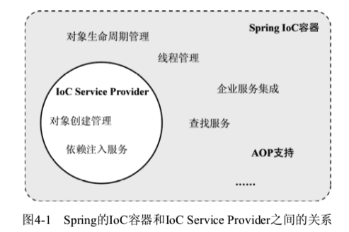
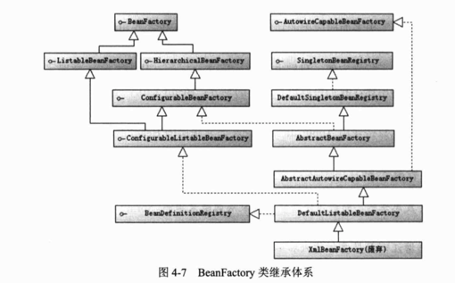
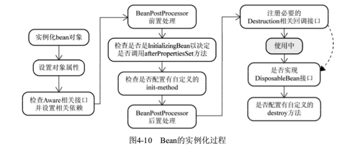
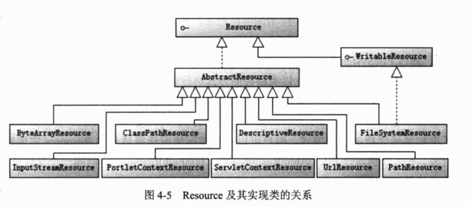
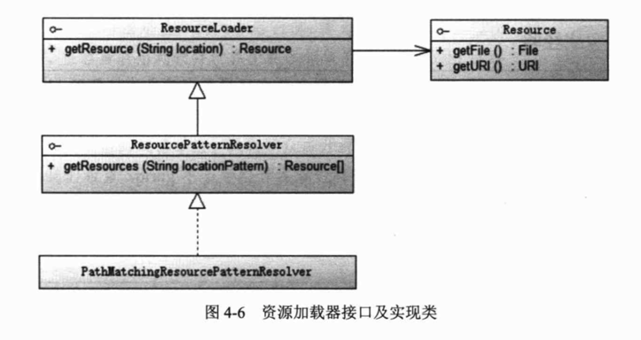
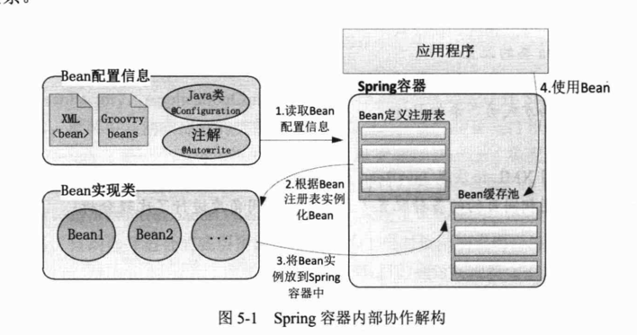

### 问题

1. 什么是DTD和XSD？
2. 构造方法注入和Setter注入这两种注入方式分别应该在什么场景下应用？
3. 父子容器的应用场景是什么？
4. Java的System类的作用是什么？


## 大纲


## IOC的基础


### 理念

IOC（Inverse of control），控制反转，通俗点来讲，可以用**让别人为你服务**来解释。它是一种思想，其主要的意义在于：**将各个业务对象进行解耦，把他们之间的依赖关系的创建转移到外部，从而产生方便代码维护以及易单元测试等一系列的好处。**

实际上，抛开实际生产当中的种种复杂情况，而用一种最简单的方式去理解IOC，它其实是一种非常好理解的概念。用一种比较抽象的语言来概括，它只不过是**将本来需要你做的事转移到了第三方手里**，仅此而已。这种工作的转移减少了我们的工作量，从而在**整体上**提高了生产力。

还是站在一种比较抽象的角度去看，IOC思想很大程度上的职责单一原则的一种表现，我们的应用程序专注于我们所应该提供的服务，像对象创建这种事交给第三责任方去做。现在有各种各样的框架和库，它们本质上的目的都是为了提高企业级应用程序开发的效率，它们抽离了越来越多的与我们本身业务无关的繁杂事务，利用优雅的设计对这些功能进行封装并经过严格的测试形成一个稳定的程序模块对外提供使用的接口，供各个应用程序的制作方去使用。一个好的框架，在极大的提高了被服务方的生产力的同时，也能给自身带来极大的收益。回头来再来看Spring就是这样一种框架，它的IOC容器在整个框架的核心位置上，为企业级应用程序开发解决了各业务对象间相互依赖导致的各种各样的问题，它能够让应用程序开发者不必再去关注业务对象如何创建，从而专注在他们的业务当中，当需要一个依赖的时候，只需要向Spring这个稳定的容器去要即可。

IOC的好处

* 便于系统扩展。

* 便于单元测试。


## 掌管大局的IOC Service Provider（ISP）


将依赖工作从本类（这个东西可以认为是应用程序当中的业务代码吧）当中移除，放在其他专门用来绑定对象关系的类（这个应该是可以认为是框架代码）当中去做。

Spring的IOC容器就是一个提供依赖注入服务的IOC Service Provider。IOC Sercice Provider负责将对象绑定起来。

### ISP职责

* 业务对象的构建管理
* 业务对象间的依赖绑定


### ISP如何管理对象之间的依赖关系

通过在一个地方把这些依赖关系记录下来，主要通过三种方式

* 直接编码方式
* 配置文件方式
* 元数据方式


## Spring的IOC容器的BeanFactory

### Spring IOC容器的职责

Spring的IOC容器所拥有的主要功能如下图。



### 两种容器

在Spring当中有两种容器类型，他们分别是：

* BeanFactory
* ApplicationContext

二者的关系：


BeanFactory类体系结构




### BeanFactory对编码的影响

没啥影响，就是业务对象之间的依赖关系已经不再需要我们自己来管理了，BeanFactory会说，让我来干吧。它通过XML文件来构建对象并将对象的依赖绑定起来，然后我们通过它来获取我们需要的对象。

原来我们这样获取对象：

```java
Bean object = new Bean();
```

现在我们这样获取对象：

```java
BeanFactory container = new XmlBeanFactory(new ClassPathResource("配置文件路径"));
Bean bean = container.getBean("beanid");
```

或者

```java
ApplicationContext container = ➥
new ClassPathXmlApplicationContext("配置文件路径");
Bean newsProvider = container.getBean("beanid");
```

或者

```java
ApplicationContext container = ➥
new FileSystemXmlApplicationContext("配置文件路径");
Bean newsProvider = (FXNewsProvider)container.getBean("beanid");
```


### BeanFactory的对象注册与依赖绑定方式


### XML配置文件


#### 工厂方法与FactoryBean

工厂方法是对实例化对象的一种封装，将new对象的过程封装到工厂类中，暴露出一个接口直接返回相应的对象。我现在看待这种封装能看出来两种好处：

1. 对象的用户不用再去关心如何创建对象，直接简单的调用工厂对象的简单API即可。（简单）
2. 工厂方法暴露出来的API与直接去new对象，这两种方式，前者比后者发生改变的可能低得多。（对修改关闭）

所以说，工厂方法让整个系统的使用变简单了，而且使得整个系统在类的构造方法发生频繁改变的时候，不用大面积去更改其他类，只更改工厂类即可。

在系统当中，可能会有某些类，这些类的构造非常复杂，这个时候就可以采用工厂方法将对象的实例化过程封装起来，这样就不用每次使用该对象的时候，都需要重新写一遍这个复杂的过程，只需要调用工厂方法的简单API即可。针对这种场景，Spring也提供了相应的配置方式来配置工厂bean，工厂bean会应用到`factory-method`这个属性，这个属性会指定具体的工厂方法是什么。无论是静态工厂还是非静态工厂，Spring都提供了具体的配置。

**然而，Spring的IOC容器提供了一种Plus版的解决方案，即`FactoryBean`。**可以让一个类去实现FactoryBean这个接口，这个接口只声明了三个方法：

```java
Object getObject() throws Exception;
Class getObjectType();
boolean isSingleton();
```

* 将复杂的对象创建逻辑放在`getObject`方法中
* `getObjectType`返回该对象的类型
* `isSingleton`则告知容器是否是单例

最后，在配置文件中，将这个FactoryBean按照正常的bean进行配置即可，**其他类在想要使用该工厂生产的对象的时候，直接在ref标签中引用到这个bean即可**。

```xml
<bean id="nextDayDateDisplayer" class="...NextDayDateDisplayer"> 
  <property name="dateOfNextDay">
		<ref bean="nextDayDate"/> 
  </property>
</bean>
<bean id="nextDayDate" class="...NextDayDateFactoryBean"> </bean>
```

```java
public class NextDayDateDisplayer {
	private DateTime dateOfNextDay; // 相应的setter方法
	// ...
}
```

```java
import org.joda.time.DateTime;
import org.springframework.beans.factory.FactoryBean;
public class NextDayDateFactoryBean implements FactoryBean {
  
  public Object getObject() throws Exception { 
    return new DateTime().plusDays(1);
  }
  public Class getObjectType() { 
    return DateTime.class;
  }
  public boolean isSingleton() { 
    return false;
  } 
}
```


------


#### 方法注入

Spring的IOC容器也提供了给对象**注入一个方法**的功能。

```xml
<bean id="newsBean" class="..domain.FXNewsBean" singleton="false">
</bean>
<bean id="mockPersister" class="..impl.MockNewsPersister">
	<lookup-method name="getNewsBean" bean="newsBean"/>
</bean>
```

这个xml标签在bean标签下使用，它的语义是，在该bean下寻找getNewsBean方法，并为其注入id为newsBean的一个bean。


#### BeanFactoryAware接口

```java
public interface BeanFactoryAware {
	void setBeanFactory(BeanFactory beanFactory) throws BeansException;
}
```

我们的类实现了该接口，Spring在实例化该类的时候，就会为我们注入一个BeanFactory。


#### ObjectFactoryCreatingFactoryBean

Spring 提 供 的 一 个 FactoryBean 实 现 ， 它 返 回 一 个ObjectFactory实例。

```java
public class MockNewsPersister implements IFXNewsPersister {
  
  private ObjectFactory newsBeanFactory;
  public void persistNews(FXNewsBean bean) { 
    persistNews();
  }
  public void persistNews() {
    System.out.println("persist bean:"+getNewsBean());
  }
  public FXNewsBean getNewsBean() {
    return newsBeanFactory.getObject();
  }
  public void setNewsBeanFactory(ObjectFactory newsBeanFactory) {
    this.newsBeanFactory = newsBeanFactory;
  }
}
```

```xml
<bean id="newsBean" class="..domain.FXNewsBean" singleton="false">
</bean>

<bean id="newsBeanFactory" 		class="org.springframework.beans.factory.config.ObjectFactoryCreatingFactoryBean">
  <property name="targetBeanName"> <idref bean="newsBean"/>
  </property> 
</bean>

<bean id="mockPersister" class="..impl.MockNewsPersister">
	<property name="newsBeanFactory">
  	<ref bean="newsBeanFactory"/>
	</property>
</bean>
```


#### 方法替换

```java
public class FXNewsProviderMethodReplacer implements MethodReplacer {
	private static final transient Log logger = 	
    LogFactory.getLog(FXNewsProviderMethodReplacer.class);
	public Object reimplement(Object target, Method method, Object[] args) throws Throwable {
    return null;
  }

```

```xml
<bean id="djNewsProvider" class="..FXNewsProvider"> 
  <constructor-arg index="0">
		<ref bean="djNewsListener"/> 
  </constructor-arg> 
  <constructor-arg index="1">
		<ref bean="djNewsPersister"/>
	</constructor-arg>
	<replaced-method name="getAndPersistNews" replacer="providerReplacer">
  </replaced-method>
</bean>
<bean id="providerReplacer" class="..FXNewsProviderMethodReplacer"> 
</bean>
```


### 深入了解容器背后的原理

#### 宏观上了解Spring容器

Spring IOC所起的作用是它会以某种方式加载Configuration Metadata（通常是XML格式配置的信息），然后根据这些信息绑定整个系统的对象，最终组装成一个可用的基于轻量级容器的应用系统。

Spring容器实现以上的功能基本上分为两步：

* **容器启动**
* **Bean实例化**

##### 1. 容器启动

容器启动伊始，首先会通过某种途径加载Configuration MetaData，并对Configuration MetaData进行解析和分析，将分析后的信息编组为相应的`BeanDefinition`，最后把这些保存了bean定义必要信息的BeanDefinition，注册到相应的`BeanDefinitionRegistry`，这样容器启动工作就完成了。

##### 2. Bean实例化

经过第一阶段，现在所有的bean定义信息都通过BeanDefinition的方式注册到了BeanDefinitionRegistry中。当某个请求方通过容器的getBean方法明确地请求某个对象，或者因依赖关系容器需要隐式地调用getBean方法时，就会触发第二阶段的活动。 

该阶段，容器会首先检查所请求的对象之前是否已经初始化。如果没有，则会根据注册的 BeanDefinition所提供的信息实例化被请求对象，并为其注入依赖。如果该对象实现了某些回调接 口，也会根据回调接口的要求来装配它。当该对象装配完毕之后，容器会立即将其返回请求方使用。 **如果说第一阶段只是根据图纸装配生产线的话，那么第二阶段就是使用装配好的生产线来生产具体的产品了。** 


#### 容器的启动

##### 插手容器的启动

**BeanFactoryPostProcessor**扩展机制，允许在Bean进行实例化之前，该扩展是在第一阶段的最后一步进行的，对注册到容器的BeanDefinition所保存的信息做相应的修改。

我们可以通过实现`org.springframework. beans.factory.config.BeanFactoryPostProcessor`来达到目的。但是**通常不这么做**，而是**使用Spring提供的几个常用的实现类**。

两个由Spring提供的**比较常用**的BeanFactoryPostProcessor实现

* **PropertyPlaceholderConfigurer**

* **PropertyOverrideConfigurer**

* **CustomEditorConfigurer**

  这个后置处理器不会改变BeanDefinition的信息，他只会再向容器中注入一些新的信息，以供实例化过程的使用。

我们可以通过两种方式来应用BeanFactoryPostProcessor，分别针对基本的IoC容器BeanFactory和较为先进的容器ApplicationContext。

对于BeanFactory来说，使用起来较为麻烦，但是更灵活，ApplicationContext则更为简单，以`PropertyPlaceholderConfigurer`来举例。

BeanFactory中的使用

```java
// 声明将被后处理的BeanFactory实例
ConfigurableListableBeanFactory beanFactory = new XmlBeanFactory(new ClassPathResource("...")); 
// 声明要使用的BeanFactoryPostProcessor
PropertyPlaceholderConfigurer propertyPostProcessor = new PropertyPlaceholderConfigurer(); propertyPostProcessor.setLocation(new ClassPathResource("..."));
// 执行后处理操作
propertyPostProcessor.postProcessBeanFactory(beanFactory);
```

ApplicationContext中的使用，**ApplicationContext会自动识别这种后置处理器bean**。

```xml
<beans>
  <bean class="org.springframework.beans.factory.config.PropertyPlaceholderConfigurer"> 
  	<property name="locations">
      <list> 
        <value>conf/jdbc.properties</value>
        <value>conf/mail.properties</value>
      </list>
    </property>
  </bean>
<beans>
```


#### Bean实例化

##### Bean生命周期




###### 1. bean的实例化与BeanWrapper

内部采用**策略模式**进行实例化。涉及到的类：

* `org.springframework.beans.factory.support.InstantiationStrategy`（抽象接口）

* `SimpleInstantiationStrategy`（简单实现，使用反射）

* `CglibSubclassingInstantiationStrategy`（使用CGLib生成子类，支持方法注入，默认采用他）

  **策略 + 合容器启动过程生成的`BeanDefinition` = `BeanWrapper`**


###### 2. 设置对象属性

BeanWrapper的主要角色是：**属性设置器。**

BeanWrapper继承的接口：

* `org.springframework.beans.PropertyAccessor`（以统一的方式访问对象属性）
* `PropertyEditorRegistry`
* `TypeConverter`

BeanWrapper的实现类：

* `BeanWrapperImpl`

之前记录过CustomEditorConfigurer这个BeanFactoryPostProcessor，BeanWrapper也会应用通过它注册到Spring容器中的PropertyEditor来设置Bean的属性。


###### 2. 检查Aware接口的实现

这步就是检测是否实现了各种Aware接口，然后把各种Aware接口所对应的应该注入的对象注入进去，下边是各种Aware接口和应该注入的对象的对应关系：

- org.springframework.beans.factory.BeanNameAware —— BeanName
- org.springframework.beans.factory.BeanClassLoaderAware——ClassLoader
- org.springframework.beans.factory.BeanFactoryAware——BeanFactory

------

以下是跟ApplicationContext相关的Aware，是在前置处理步骤注入到我们的bean中的，而不是在这个步骤

* org.springframework.context.ResourceLoaderAware——ApplicationContext
* org.springframework.context.ApplicationEventPublisherAware——ApplicationContext
* org.springframework.context.MessageSourceAware——ApplicationContext
* org.springframework.context.ApplicationContextAware——ApplicationContext


###### 3.BeanPostProcessor前置处理

```java
public interface BeanPostProcessor
{
  Object postProcessBeforeInitialization(Object bean, String beanName) throws ➥ BeansException;
  Object postProcessAfterInitialization(Object bean, String beanName) throws ➥ BeansException;
}
```

Spring有默认的前置处理器：

* `ApplicationContextAwareProcessor`

它处理的工作如下：

```java
public Object postProcessBeforeInitialization(Object bean, String beanName) throws ➥ BeansException {
  if (bean instanceof ResourceLoaderAware) {
  	((ResourceLoaderAware) bean).setResourceLoader(this.applicationContext);
  }
  if (bean instanceof ApplicationEventPublisherAware) {
      ((ApplicationEventPublisherAware)bean).setApplicationEventPublisher
      (this.applicationContext）;  
  }
  if (bean instanceof MessageSourceAware) {
  	((MessageSourceAware) bean).setMessageSource(this.applicationContext);
  }
	if (bean instanceof ApplicationContextAware) {
  	((ApplicationContextAware) bean).setApplicationContext(this.applicationContext);
  }
}
```

当然也可以自定义BeanPostProcessor，总体分为2个步骤：

1. 编写BeanPostProcessor实现类
2. 将BeanPostProcessor注册到容器

实现类：

```java
    public class PasswordDecodePostProcessor implements BeanPostProcessor {
        public Object postProcessAfterInitialization(Object object, String beanName) throws BeansException {
            return object; 
        }
        public Object postProcessBeforeInitialization(Object object, String beanName) throws BeansException {
            if(object instanceof PasswordDecodable)
            {
                String encodedPassword = ((PasswordDecodable)object).getEncodedPassword();
                String decodedPassword = decodePassword(encodedPassword); ((PasswordDecodable)object).setDecodedPassword(decodedPassword);
            }
            return object; 
        }
        private String decodePassword(String encodedPassword) { // 实现解码逻辑
            return encodedPassword;
        } 
    }
```

ApplicationContext的注册

```xml
<beans>
  <bean id="passwordDecodePostProcessor" class="package.name.PasswordDecodePostProcessor">
  </bean>
</beans>
```

BeanFactory的注册

```java
ConfigurableBeanFactory beanFactory = new XmlBeanFactory(new ClassPathResource(...)); beanFactory.addBeanPostProcessor(new PasswordDecodePostProcessor());
```

BeanPostProcessor给我的感觉像是一个拦截器，所有的bean在其实例化的过程当中都要去这些拦截器里边走一遭，过一过这些拦截器的方法，对bean自身做出一些影响。

由于在BeanPostProcessor当中，可以通过`postProcessBeforeInitialization`方法的参数获取的原始的bean对象，这对于我们来说是一种非常方便的处理，几乎可以说是通过BeanPostProcessor可以对bean做任何处理。


###### 4.**InitializingBean**和**init-method**

`InitializingBean`和`init-method`的作用是一样的，如果某个bean希望某个方法能够被先执行以让整个bean能够正常工作，那就可以使用Spring提供的这两种方式去进行扩展。

另外，值得说明的是，init-method是在配置文件中进行配置的，可以通过bean的这个属性来指定我们的bean里边的任何一个方法作为初始化方法。而InitializingBean它是一个接口，要想达到相同的目的，需要我们先实现这个接口，然后Spirng调用实现了这个接口的类的实现方法，这样显得比较具有**侵入性**。

关于侵入性，这里记录一下。

**当你的代码引入了一个组件,导致其它代码或者设计,要做相应的**更改以适应新组件**.这样的情况我们就认为这个新组件具有侵入性**。


###### 5.**DisposableBean**与**destroy-method**

与第四部基本是相同的东西，spring提供给外部bean的一个写bean销毁逻辑的地方。不过，这些自定义的对象销毁逻辑，在对象实例初始化完成并注册了相关的回调方法之后，并不 会马上执行。回调方法注册后，返回的对象实例即处于使用状态，只有该对象实例不再被使用的时候， 才会执行相关的自定义销毁逻辑，此时通常也就是Spring容器关闭的时候。但Spring容器在关闭之前， 不会聪明到自动调用这些回调方法。所以，需要我们告知容器，在哪个时间点来执行对象的自定义销 毁方法。


## Spring的IOC容器的ApplicationContext

ApplicationContext是Spring在BeanFactory基础容器之上，提供的另一个IoC容器实现。它拥有许多BeanFactory所没有的特性，包括

* 统一的资源加载策略

* 国际化信息支持

* 容器内事件发布

* 简化的多配置文件加载功能。

  

  





