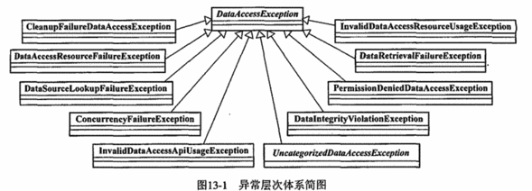
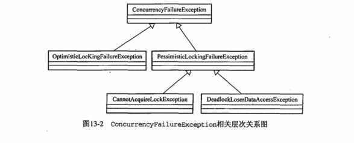

# 使用Spring访问数据

数据访问层可以分为三个部分

1. 统一的数据访问异常层次体系
2. JDBC API的最佳实践
3. 以统一的方式对各种ORM方案的集成

总的来说，Spring数据访问层实际上就是以统一的数据访问层异常体系为核心，以JDBC API的作家时间和以统一的方式对各种ORM方案的集成为两翼，为Java平台的数据访问铺平了一条平坦的大道。

## 统一的数据访问异常层次体系

## Spring对iBatis的集成

传统的ibatis

